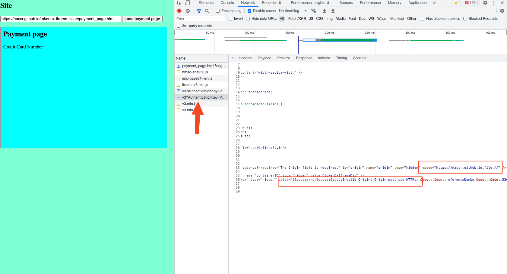

Example based on https://jsfiddle.net/TokenExSupport/jupnz2rf/, to show loading tokenex from in 2 ways
# Site page from **https**
   Site (from https) -> payment page (iframe, from https) -> tokenex (iframe, from https)
   1. Open https://naccr.github.io/tokenex-iframe-issue/site.html in google chrome
   2. Click load
   3. Field with pan loaded from tokenex
   
# Site page from **file**
   Site (**from file**) -> payment page (iframe, from https) -> tokenex (iframe, from https)
   1. Clone repository
   2. Open file://site.html in google chrome
   3. Click load
   4. Field with **pan was not loaded from tokenex, and there is error in network**
   
Passed tokenex iframe config can be found in console (difference in `origin: https://naccr.github.io,file://`):
```json
{
  "origin": "https://naccr.github.io,file://",
  "timestamp": "20230125131514",
  "tokenExID": "6468548879812671",
  "tokenScheme": "1",
  "authenticationKey": "Xmp3kptiyNkgGKGb0NZbTszRW3AJRbTdrGHazBFAkGk=",
  "pci": true,
  "cvv": true,
  "inputType": "text",
  "inputMaxLength": 16,
  "cvvContainerID": "cvvID"
}
```

Error in network `Invalid Origin; Origin must use HTTPs`, looks there is no ability to use `file://` for root page
